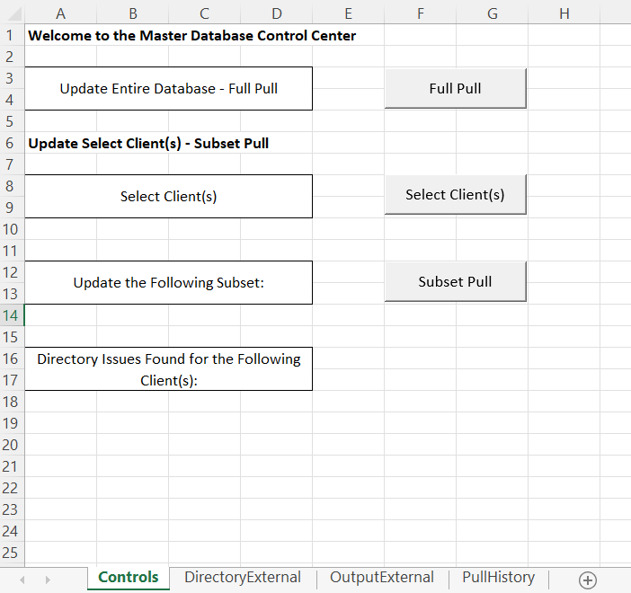

# VBA-Master-Database
This VBA project allows for a command center to parse through different excel files, gathering information to send to a "master" database.

## Table of Contents:
- [Backgound](#background)
- [Initial Setup](#initial-setup)
- [Updating the Database](#updating-the-database)
- [The Output](#the-output)

## Background
The task was to create a database that housed information about each client, updated from their client Excel workbooks. The main obstacle was that each client's workbook (and sometimes each year in the workbook) were unique. Essentially, it wasn't feasible to create a scraper that simply went through the workbooks and gathered this information. However, placing a uniform data input page in each of these workbooks would allow for easy scraping of information into a single place. The datapoints in the final project were extensive and exhaustive for the information contained across all clients. What's presented here is the template design for this scraper, illustrated with just a few datapoints.

[Table of Contents](#table-of-contents)

## Initial Setup
Each client will have an input tab that has general information (constant through the years of data) and variable information (likely to change through the years of data).

Here is an example (Client1):

Please note that the name of the input tabs DO NOT need to be the same across all clients. But, do take note of the tab name.

After the input page is setup, open the "Directory" tab in the "MDB Controls - Link" file (this is essentially the command center). Entered on this page is the client name, location to the excel file, and location to the input tab. Once again, the name of the input tabs DO NOT need to be the same across all clients. They just are in this example.

Six mock clients are entered in the example, with the "ClientError" client being there for an error handling example.

Example:

Don't worry about entering in the number of plan years, this is filled automatically from the client input tab when the program is run.

The hard part is over! Just a few selections on the Controls page, and the automation will commence.

[Table of Contents](#table-of-contents)

## Updating the Database
Starting on the "Controls" tab of the "MDB Controls - Link" file, there are a few buttons present:
- Full Pull
- Select Client(s)
- Subset Pull

Full Pull: this will update the database across every client in the directory. After the database has been updated, a pop-up will appear:

Select Client(s): If only a subset of clients need to be updated, use the Select Client(s), which will open a form:

By holding ctrl, it is possible to select multiple clients:

After the client selection is made, the client(s) selected will appear under "Update the Following Subset" text:

Subset Pull: only the client(s) which appear under the "Update the Following Subset" text will be updated when this button is pressed. After the database has been updated, a pop-up will appear:

Additionally, notice how the under the text "Directory Issues Found for the Following Client(s)" is our error handle testing client "ClientError". A false address was given to this client to illustrate that in the event a directory error occurs, the code will keep running, but the issue will be noted.

Note: in the back-end of things, directoy errors are caught when the program fetches number of years of data. If there is an error, the number of years will simply be 0 (look back at the directory example above to see the years of data for ClientError).

[Table of Contents](#table-of-contents)

## The Output
The data has been updated, but where is it?

Once the update has finished, go to the OutputExternal tab to see all of the data in a single place:

Additionally, historical records of each pull is kept, with the corresponding data a click away:

***IMPORTANT: Currently, the datafields in the input tab and the OutputExternal page need to be manually updated. This example uses 4 constant general datapoints, and 4 variable datapoints. Both tabs need to be updated manually, as well as a few ranges in the code (which are clearly marked). Most of the code doesn't have hard typed values, but there are a few functions which haven't been addressed.***

The database command center was designed to have a select few users who could operate and update the "master" database. The intent being data updates are to be ran periodically, or upon request to prevent any accidental changes to the infrastructure of the command center. In leiu of this, each pull is also kept in a specified folder:

An additional step was taken to ensure integrity of the data by promoting the files to be opened in read-only mode (or copied to another location entirely):

Note that the date of the pull and the type of pull (Full vs. Sub) is addressed both of the historical record keeping places.

The overall idea is to keep the command center private, but access to the database public, to ensure future analysis on the data doesn't jeopardize the original information. There should always be an accurate copy of the database this way, and analysis can take place without hesitation.

[Table of Contents](#table-of-contents)
